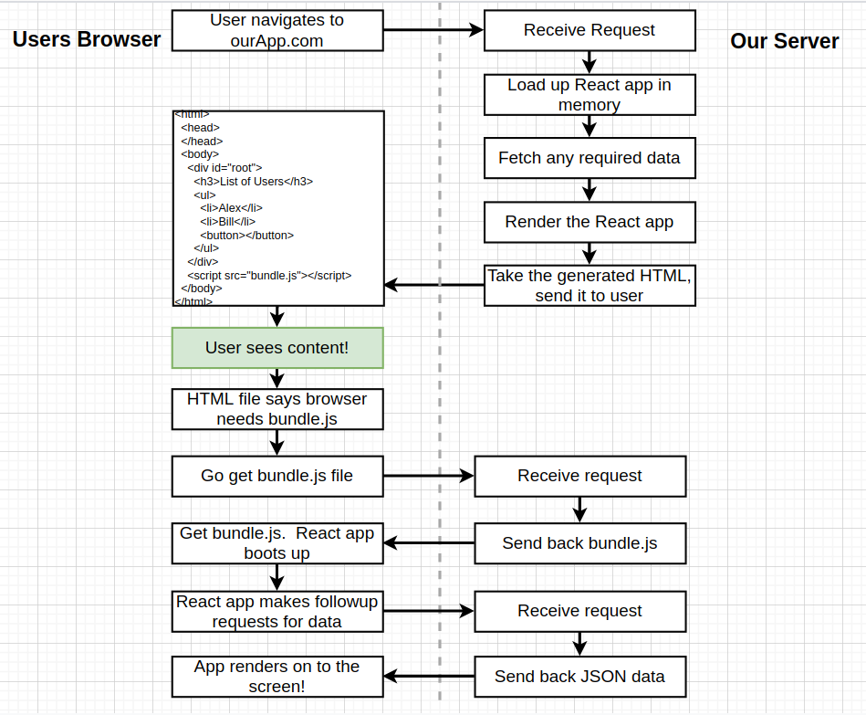
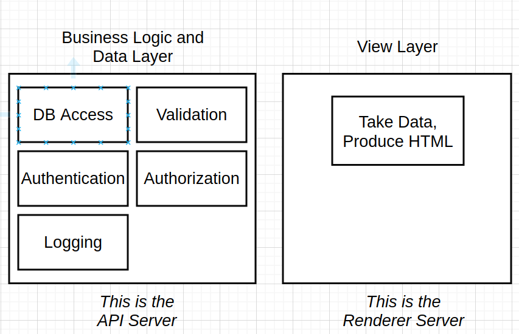
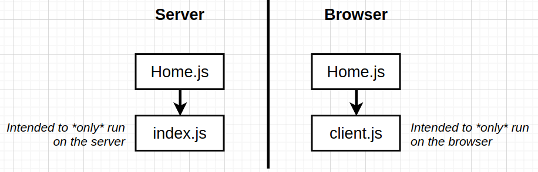
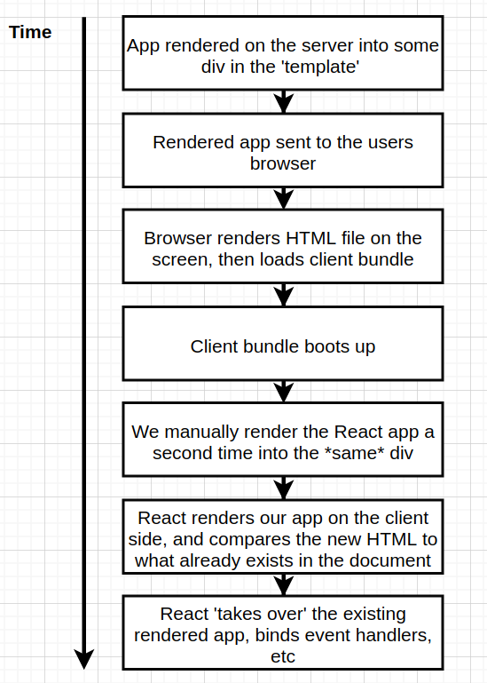
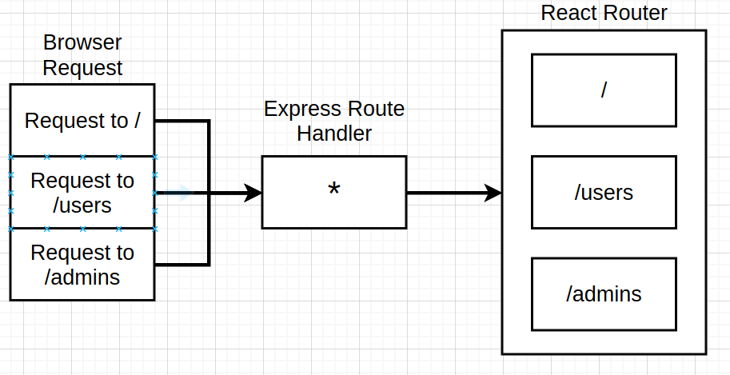
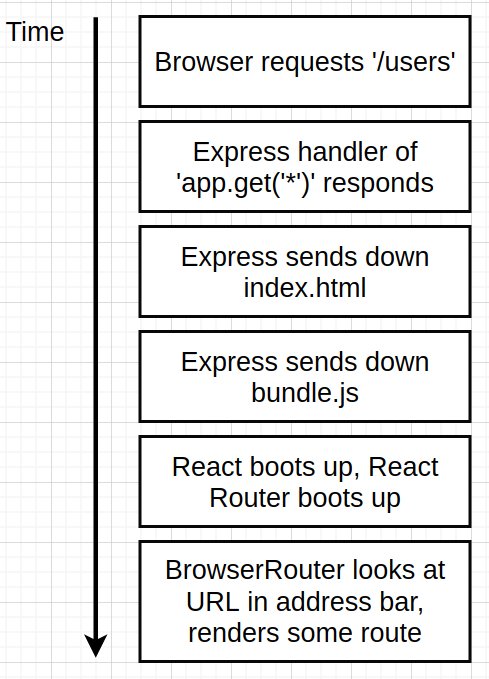
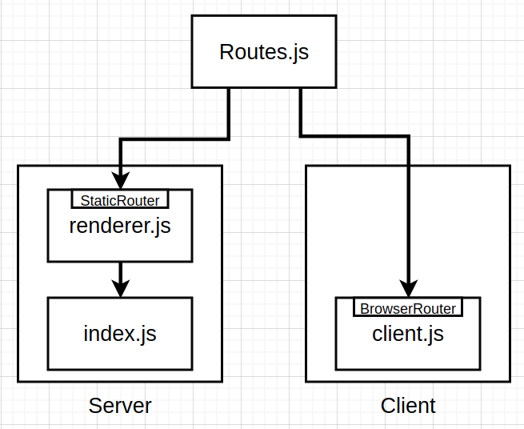

## Overview: 

  - This repo provides some information about SSR, why we use them, and challenges of SSR.
  - I will use React, with redux and React Router, Also, topics like authentication will be discussed.

## Why?

  - How traditional React app works?

    1. The browser makes a request to the server (hosting the app), and an html document is returned by the server
    2. The html document has a script tag with `src` to the entire react app as a bundle (bundle.js).

  

  - Traditional React apps take a slightly long time to get content visible on the screen, which is a behavior we want to avoid.

  - With SSR, whne the browser reach out to server, it will get an html document thta has much more content compared to the traditional react app. So, having a full document really get content to screen pretty fast. (We are still using react on the client).

  

## App Overview:

  - We would have `two` separate backend servers, onr for business logic (auth, logging, db access, ...) and the other one for rendering the html document.

  -  the first benefit of this separation is that we could replace react with any other technology at any time.

  - Another benefit is that we could scale out each server separately.

  - IMPORTANT NOTE: SSR performance is not fast and needs optimization (like having fast machines for the rendering servers). check out this [Walmart labs blog post](https://medium.com/walmartglobaltech/using-electrode-to-improve-react-server-side-render-performance-by-up-to-70-e43f9494eb8b) 

  

## Notes: 

  - **ReactDOM.render**: Creates instances of a bunch of components and mounts them to a DOM node.
  - **ReactDOM.renderToString**: renders a bunch of components one time and produces a string out of all the resulting HTML.

  - Isomorphic/Universal Javascript: same code runs on both client and server (like using es5 imports on the server)
  - Server-side Rendering: Generate HTML on the server and ship it down to the client.

  - Event handlers (onClick, ...) are registered after component is re4ndered and atached to the dom in a regular react app.
  - But in the case of SSR, no JS files are sent to the user by default, So, we need, after sending HTML, to send our react app that have the JS functionality.

  - So to ship the react app to the browser we are going to create a **second bundle** that only contains the React App code (the first one contains server code + react app).

  ## Why second bundle ??

  - These are the two bundles we create right now.
  - `indexjs` serves as the root (bootup) for the react app on the server, and `clientjs` serves as the root (bootup) for the react app on the browser.

  

  - `indexjs` on the server depends on the `Home.js` component, and also  the `clientjs` file depends on `Home.js` component, **but** we need the segregation between them for many reasons, the first one being server code might have sensitive data that cannot be sent to the client

  - Another reason is when we add Router and Redux, we will need different configurations for them when executed on the server or on the client.

  - the process of putting functionality back to an html that's already rendered is called **Hydration**.

  Code Execution Order on the browser with SSR:
  -----

  

## Routing Inside SSR Application:

  - We have two tiers of routing inside our app like shown in th picture below
  

  - express route handler will delegate  requests to react router instead of handling it. So react router has the final saying in what gets shown on the screen. (both on server -delegating reqs to it by express handler- and on client when hydration occur).

  ## How React Router Work ? (BrowserRouter)

  

  - So browser router looks at address bar in the browser, This is hardcoded in it, So we can't use it inside our sevrer.

  - We will use `StaticRouter` when we need routing on the server, and `BrowserRouter` when the application gets hydrated on the browser.

  - the setup will look like this:

  

  - `Routes.js`: Will include all route mappings.
  - Import this `Routes.js` file into:

    1. `rerenderer.js` on the server - This uses `StaticRouter`.
    2. `client.js` on the client/browser - This uses `BrowserRouter` .

