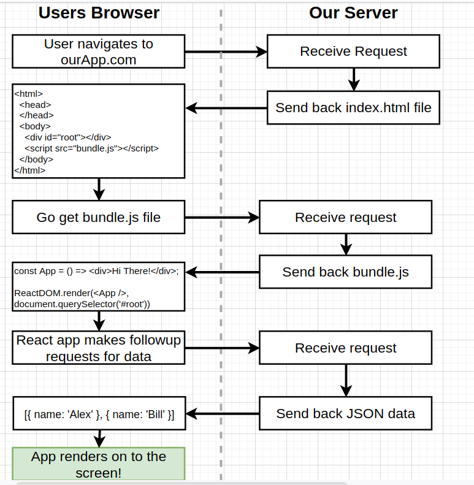
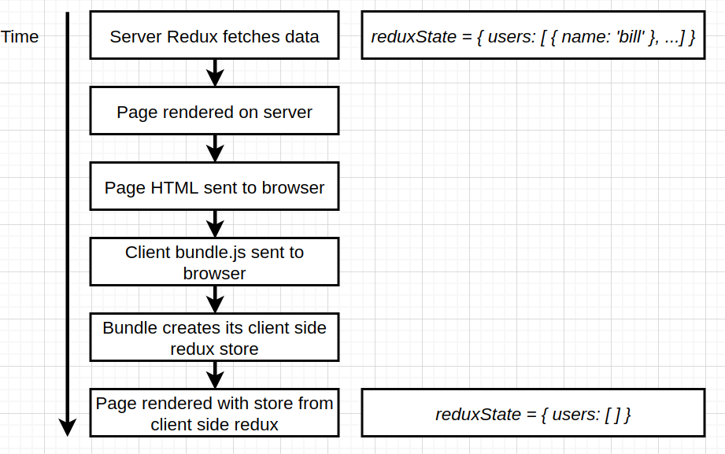
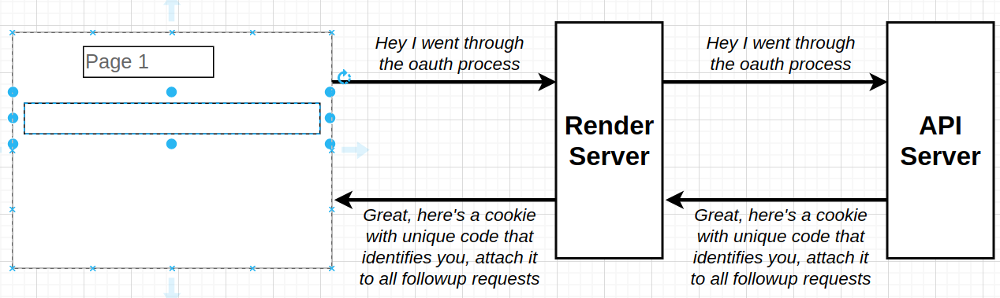

## Overview: 

  - This repo provides some information about SSR, why we use them, and challenges of SSR.
  - I will use React, with redux and React Router, Also, topics like authentication will be discussed.

## Why?

  - How traditional React app works?

    1. The browser makes a request to the server (hosting the app), and an html document is returned by the server
    2. The html document has a script tag with `src` to the entire react app as a bundle (bundle.js).

  

  - Traditional React apps take a slightly long time to get content visible on the screen, which is a behavior we want to avoid.

  - With SSR, whne the browser reach out to server, it will get an html document thta has much more content compared to the traditional react app. So, having a full document really get content to screen pretty fast. (We are still using react on the client).

  

## App Overview:

  - We would have `two` separate backend servers, onr for business logic (auth, logging, db access, ...) and the other one for rendering the html document.

  - the budiness logic server lives at `https://react-ssr-api.herokuapp.com/`

  -  the first benefit of this separation is that we could replace react with any other technology at any time.

  - Another benefit is that we could scale out each server separately.

  - IMPORTANT NOTE: SSR performance is not fast and needs optimization (like having fast machines for the rendering servers). check out this [Walmart labs blog post](https://medium.com/walmartglobaltech/using-electrode-to-improve-react-server-side-render-performance-by-up-to-70-e43f9494eb8b) 

  

## Notes: 

  - **ReactDOM.render**: Creates instances of a bunch of components and mounts them to a DOM node.
  - **ReactDOM.renderToString**: renders a bunch of components one time and produces a string out of all the resulting HTML.

  - Isomorphic/Universal Javascript: same code runs on both client and server (like using es5 imports on the server)
  - Server-side Rendering: Generate HTML on the server and ship it down to the client.

  - Event handlers (onClick, ...) are registered after component is re4ndered and atached to the dom in a regular react app.
  - But in the case of SSR, no JS files are sent to the user by default, So, we need, after sending HTML, to send our react app that have the JS functionality.

  - So to ship the react app to the browser we are going to create a **second bundle** that only contains the React App code (the first one contains server code + react app).

  ## Why second bundle ??

  - These are the two bundles we create right now.
  - `indexjs` serves as the root (bootup) for the react app on the server, and `clientjs` serves as the root (bootup) for the react app on the browser.

  

  - `indexjs` on the server depends on the `Home.js` component, and also  the `clientjs` file depends on `Home.js` component, **but** we need the segregation between them for many reasons, the first one being server code might have sensitive data that cannot be sent to the client

  - Another reason is when we add Router and Redux, we will need different configurations for them when executed on the server or on the client.

  - the process of putting functionality back to an html that's already rendered is called **Hydration**.

  Code Execution Order on the browser with SSR:
  -----

  

## Routing Inside SSR Application:

  - We have two tiers of routing inside our app like shown in th picture below
  

  - express route handler will delegate  requests to react router instead of handling it. So react router has the final saying in what gets shown on the screen. (both on server -delegating reqs to it by express handler- and on client when hydration occur).

  ## How React Router Work ? (BrowserRouter)

  

  - So browser router looks at address bar in the browser, This is hardcoded in it, So we can't use it inside our sevrer.

  - We will use `StaticRouter` when we need routing on the server, and `BrowserRouter` when the application gets hydrated on the browser.

  - the setup will look like this:

  

  - `Routes.js`: Will include all route mappings.
  - Import this `Routes.js` file into:

    1. `rerenderer.js` on the server - This uses `StaticRouter`.
    2. `client.js` on the client/browser - This uses `BrowserRouter` .

**Html Mismatch** occurs when a mismatch occur between what gets produced on the client and on the server, so the html from server is different from what react app produces on the browser.

  ## Redux with SSR ??

  - We have four big challenges with regard to Redux with SSR.

  

  1. the first one is a result of the other three challenges and should be solved by having two stores one on the server and the other o the client.
  2. We need to know who is authenticated, and we are using cookie based auth, and this data is hard to obtain on the server.
  3. on the browser, we call `actionCreator`, and let it do its thing (fire request, signal it has finished, run reducer, react re-renders when we state change ), but now on the server we need to handle all these steps that were handled for us on the browser.
  4. this is the easier one :)

  - babel-polyfill is a module that enable using async/await syntax inside am action creator

  ### What happens when we invoke an action creator (on browser vs on server) ?

  - right now on the browser this is the flow (normal react flow)

  

  - but on the server, we respond immediately after rendering app without waiting for the reducer to run and re-render the app, So the `componentDidMount` lifecycle method does not get called on the server.

  

  #### Solution one:

  - try to render the app two times:

  

  - This solution has a **pro** of not having to write a lot code (however we need to know when action creator finishes)
  - But, there are some **cons**: 
    1. Rendering the app twice (takes a lot of resources to render a react app)
    2. This solution only works with one round of requests. (So a scenartio like requireAuth -> fetch Resource that require auth would not work.)

  #### Solution two: (Data Loading solution taken by most of frameworks)

  

  - This solution has a **con** that we need to write more code.
  - But the **Pros** are:
    1. only render app one time.
    2. Makes data required by each component clear.

  - **Note** that for us to know what component will be rendered from the url we can not rely on the current Router (StaticRouter) configuration we have, because Router needs the app to be rendered first and that we don't need.

  - react-router-config is a library that allow us to inspect what components are needed for a requested page before the app gets rendered.

  - We will define a `loadData` function on each component that preloads any data that a component needs before being rendered

  

  ### Client State rehydration:

  - there is an issue that rises from the fact that we create and populate a store on the server, but when bundle is sent to client the browser creates another empty redux store, causing an error to be logged in the browser console (becuase empty store clears page temporarily).

  

  - the solution simply is to dump server store state into the HTML template and when bundle is shipped to the browser it will use the dumped data inside the HTML to init the browser store with it.

  

  -**NOTE**: React render function by default serialize and sanitize user input, but in case of SSR we are sending content as string without sanitizing anything (Use serialize-javascript instead of json.stringfy)

## Authentication With SSR ?

  - Our API uses **cookies** after going through OAuth flow, but the issue with cookies is that cookies are associated with full domain, so requests to sub domains will not include the cookie. So our Render Server will not be able to make requests to API server on behalf of the browser.

  

  - one solution to setup a proxy on the render server itself, and when a user wants to authenticate with the API server , they will go through that proxy first.

  

  - **Note** that the initial page loading does not require the proxy (render server will make the request on behalf of the browser.)

  

  ### Why Not JWTs ? 

  *remember that jwts could be used inside a cookie, but here I am discussing JWTs inside header, url or body of request*.

  - The idea of SSR to send rendered content as fasf as possible, and when we think of the first initial request to the server, we would not be able to attach such a jwt and get content right away.

  - Also think of a scenario that a user tpe the url in the browser bar and hits enter, we have zero control on that request except that cookies are sent by default with any request.
